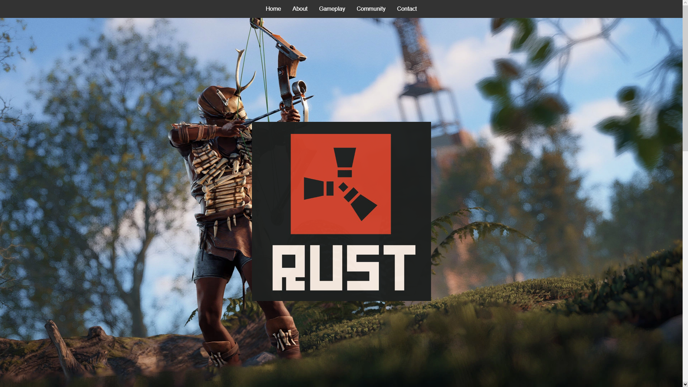
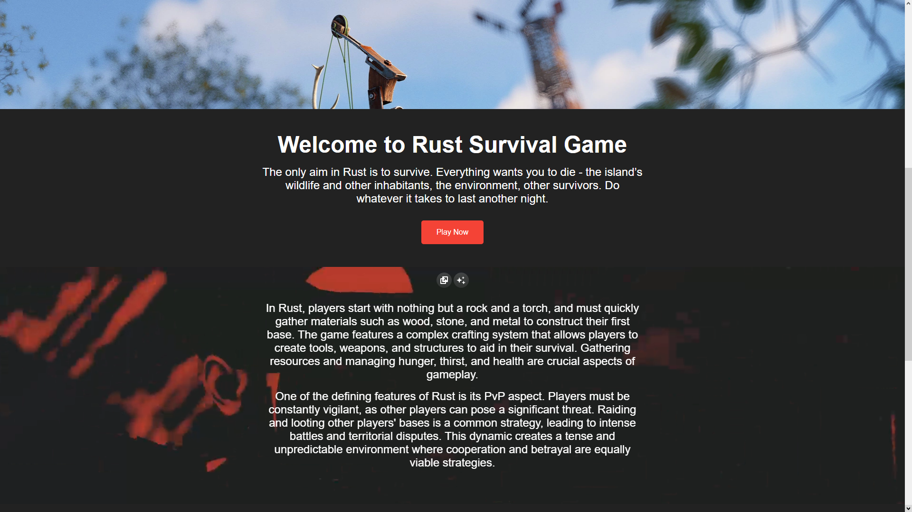
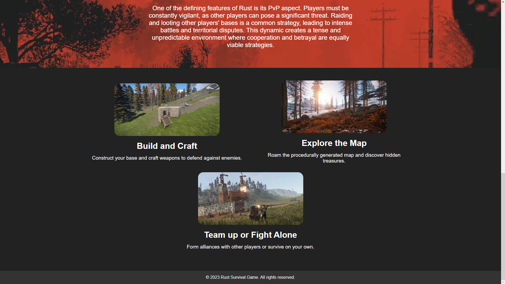
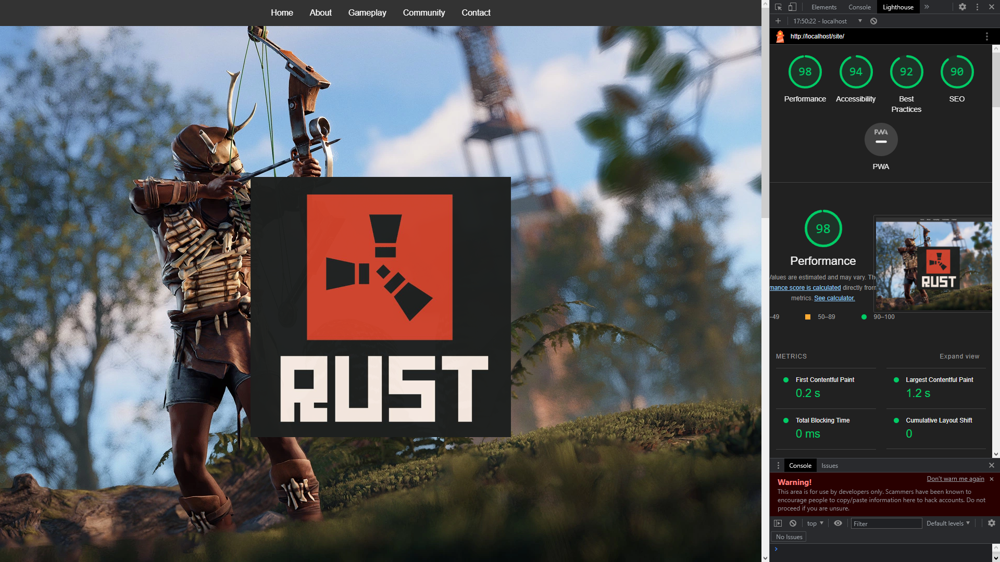

# RUST

## Popis

Tento web je o survival hře jménem Rust. Rust je sandboxová hra, ve které se hráči snaží přežít v divočině, budovat si úkryty, vyrábět nástroje a zbraně, bojovat s nepřáteli a spolupracovat s ostatními hráči. Hra je založena na principu přežití v drsném a nehostinném prostředí, kde je důležité sbírat suroviny, lovit zvěř, stavět si vlastní domovy a bránit se před nepřáteli.

Na tomto webu najdete informace o hře Rust. Pokud by byl dodelany nav a presmerovaval na dalsi stranky webu tak by web slouzil jako zdroj informací pro hráče, kteří se zajímají o Rust a chtějí se dozvědět více o herním prostředí, herních mechanikách, strategiích a dalších souvisejících tématech.

## Licence

Tento software je poskytován "tak jak je" a Zer0x739 odmítá všechny záruky s ohledem na tento software, včetně všech předpokládaných záruk obchodovatelnosti a vhodnosti. V žádném případě nebude Zer0x739 odpovědný za jakékoliv zvláštní, přímé, nepřímé nebo následné škody či jakékoliv škody vzniklé ze ztráty používání, dat nebo zisku, ať již v případě konání, nebo akce nebo v souvislosti s používáním nebo výkonem tohoto softwaru.

